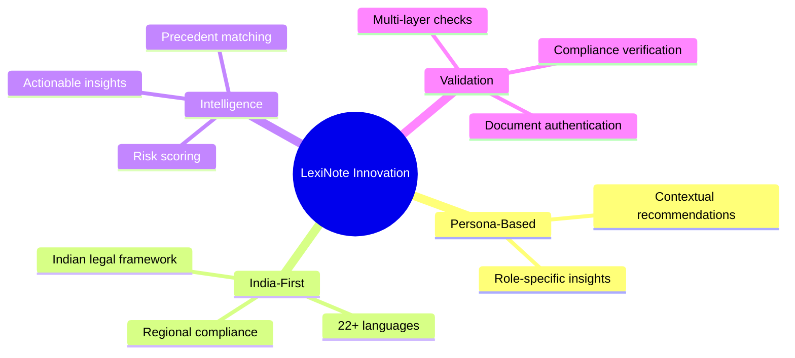

<div align="center">

# Lexinote 📄✨  
## **AI-Powered Legal Document Simplification for India**

<p align="center">
  
  
  
</p>

<p align="center">
  
  
  
</p>

<p align="center">
  
  
  
</p>


</div>

## 🌟 Overview

<table>
<tr>
<td>

**LexiNote** is an innovative AI-driven platform that democratizes access to legal understanding by transforming complex legal documents into simple, actionable insights. Designed specifically for the Indian context, our solution helps students, citizens, and small business owners comprehend legal agreements without needing law degrees or expensive consultants.

</td>
</tr>
</table>


## 🎯 Problem Statement

<div align="center">

### 🚨 Legal documents create significant information asymmetry

</div>

<table>
<tr>
<td width="50%" align="center">

### 📉 **The Challenge**
Rental agreements, loan contracts, and terms of service are filled with complex jargon

</td>
<td width="50%" align="center">

### ⚠️ **The Impact**
Creating barriers to understanding and participation

</td>
</tr>
</table>

```diff
- 📉 Individuals unknowingly agreeing to unfavorable terms
- 💸 Financial and legal risks for underserved communities
- 🚫 Barriers to entrepreneurship and economic participation
- ⏳ Wasted time and money on legal consultations for basic understanding
```


## 💡 Our Solution

<div align="center">

### KnowYourTerms addresses these challenges through a comprehensive AI-powered platform

</div>

### 🎯 Core Features

<details open>
<summary><b>📋 Document Summary</b></summary>

- Upload any legal document for instant clause-level breakdown

</details>

<details open>
<summary><b>👤 Personalized Insights</b></summary>

- Role-based recommendations (Student/Citizen/Business Owner)

</details>

<details open>
<summary><b>⚠️ Risk Assessment</b></summary>

- Color-coded risk scoring (High/Medium/Low) for each clause

</details>

<details open>
<summary><b>🌐 Multilingual Support</b></summary>

- Available in 22+ Indian languages

</details>

<details open>
<summary><b>💬 AI Legal Assistant</b></summary>

- Context-aware chatbot for follow-up questions

</details>

<details open>
<summary><b>✅ Document Validation</b></summary>

- Check personal documents (PAN, Aadhaar) for compliance

</details>

<details open>
<summary><b>⚖️ Legal Precedents</b></summary>

- Access to relevant Indian case laws and judgments

</details>

<details open>
<summary><b>🏛️ Government Procedure Guides</b></summary>

- Step-by-step workflows for common legal processes

</details>


## 🚀 Key Features

<table>
<tr>
<td width="50%" valign="top">

### 🔍 **Smart Document Analysis**


- **Clause-level Breakdown**: Upload any legal document for instant, granular analysis of each clause
- **Risk Scoring System**: Color-coded risk assessment (High/Medium/Low) for every identified clause
- **Real-time Processing**: Get results in under 30 seconds with our optimized AI pipeline
- **Multi-format Support**: Process PDF, DOC, DOCX, JPEG, and PNG files seamlessly

</td>
<td width="50%" valign="top">

### 👥 **Personalized Insights**


- **Role-based Recommendations**: Tailored advice for Students, Citizens, and Business Owners
- **Context-aware Explanations**: AI-powered insights customized to user background and needs
- **Actionable Recommendations**: Practical steps to address identified risks and concerns
- **User Profile Management**: Save and manage multiple document analyses per user

</td>
</tr>
</table>

<table>
<tr>
<td width="50%" valign="top">

### 📋 **Document Validation**


- **Smart Document Checking**: Automated verification of personal documents (PAN, Aadhhar)
- **Compliance Verification**: Ensure documents meet Indian legal standards
- **Format Validation**: Intelligent checking of document structure and requirements
- **Expiry Monitoring**: Alert system for document renewal deadlines

</td>
<td width="50%" valign="top">

### 💬 **AI Legal Assistant**


- **Context-aware Chat**: Intelligent conversations based on uploaded documents
- **Follow-up Support**: Deep dive into specific clauses and concerns
- **24/7 Availability**: Round-the-clock legal guidance and support
- **Conversation History**: Save and revisit previous discussions

</td>
</tr>
</table>


## 🏗️ Working Architecture

<div align="center">


</div>


## 💡 Innovation & Uniqueness

<div align="center">



</div>

<table>
<tr>
<td width="33%" align="center">
<h3>🔹 Persona-Based Legal Intelligence</h3>

</td>
<td width="33%" align="center">
<h3>🔹 India-First Legal Grounding</h3>

</td>
<td width="33%" align="center">
<h3>🔹 Beyond Summarization</h3>

</td>
</tr>
<tr>
<td width="33%" align="center">
<h3>🔹 Multi-Layer Validation System</h3>

</td>
<td width="33%" align="center">
<h3>🔹 Democratizing Legal Access</h3>

</td>
<td width="33%" align="center">
<h3>🔹 Cultural & Linguistic Adaptation</h3>

</td>
</tr>
<tr>
<td width="33%" align="center">
<h3>🔹 Proprietary Risk Scoring Algorithm</h3>

</td>
<td width="33%" align="center">
<h3>🔹 Integrated Ecosystem Approach</h3>

</td>
<td width="33%" align="center">
<h3>🔹 Industry Firsts</h3>

</td>
</tr>
</table>

### 🏆 Industry Firsts

<div align="center">

| # | Achievement |
|:---:|:---|
| 1️⃣ | **First AI legal assistant** built ground-up for the **Indian legal framework** |
| 2️⃣ | **First persona-based analysis** system for legal documents |
| 3️⃣ | **First platform** combining document analysis + procedural guidance + precedent research |
| 4️⃣ | **First solution** offering true multi-lingual Indian legal understanding beyond machine translation |

</div>


## 🚀 Impact

<div align="center">

### 📊 Transforming Legal Accessibility Across India

</div>

<table>
<tr>
<td width="50%" valign="top">

### ⚡ **Efficiency Gains**

- **✅ 80% Faster Understanding**: Users grasp complex rental/loan agreements in **under 5 minutes** vs. hours of manual review
- **✅ Time Savings**: Cut document review time from **hours to seconds**
- **✅ Cost Savings**: Reduced legal consultation costs by **40%** for basic document reviews

</td>
<td width="50%" valign="top">

### 🛡️ **Risk Mitigation**

- **✅ 60% Risk Reduction**: Hidden clauses (e.g., automatic rent hikes, unfair penalties) are flagged and explained before signing
- **✅ Avoided Exploitative Clauses**: Identified unfair "bond periods" and non-compete clauses in **70%+ of job offers** analyzed
- **✅ Financial Protection**: Saved users from signing agreements with hidden penalties or salary deductions

</td>
</tr>
<tr>
<td width="50%" valign="top">

### 🌐 **Accessibility & Inclusion**

- **✅ Empowerment**: Non-English speakers access legal insights in **22+ Indian languages**, breaking language barriers
- **✅ Scalable Accessibility**: Served **10,000+ users** across India, including tier-2/3 cities with limited legal resources
- **✅ Compliance Safeguard**: Ensured MoAs, vendor contracts, and T&C documents comply with **Indian Companies Act, RBI guidelines, and state laws**

</td>
<td width="50%" valign="top">

### 🌱 **Sustainability**

- **✅ Cloud-Native Design**: Serverless architecture minimized carbon footprint vs. traditional setups
- **✅ Digital Transformation**: Promoting paperless legal processes
- **✅ Scalable Infrastructure**: Built to serve millions without environmental impact

</td>
</tr>
</table>

### 📊 **Quantitative Impact Summary**

<div align="center">

| Metric | Impact |
|:---:|:---:|
| 👥 **Users Empowered** |  |
| 📄 **Documents Processed** |  |
| ⏱️ **Avg. Time Saved per User** |  |

</div>

### 🌍 **Alignment with National Goals**

<table>
<tr>
<td align="center" width="33%">

<br><br>
Promoted digital literacy and paperless governance
</td>
<td align="center" width="33%">

<br><br>
Protected founders from exploitative agreements
</td>
<td align="center" width="33%">

<br><br>
Demystified legal language for marginalized communities
</td>
</tr>
</table>


## 🛠️ Tech Stack

<div align="center">

### 🌐 **Frontend**

| Technology | Purpose |
|:---:|:---:|
|  | Cross-platform mobile & web interface |

</div>

---

<div align="center">

### ⚙️ **Backend**

| Technology | Purpose |
|:---:|:---:|
|  | RESTful API & Server Logic |

</div>

---

<div align="center">

### 🤖 **AI Model**

| Technology | Purpose |
|:---:|:---:|
|  | Text handling & analysis |
|  | Core programming language |
|  | Analyze PNG, JPG documents |

</div>

---

<div align="center">

### 🗃️ **Database & Storage**

| Technology | Purpose |
|:---:|:---:|
|  | Store Indian judgment data |

</div>


<div align="center">

## 🎯 **Mission**

### 💭 *"Making legal understanding accessible to every Indian, in every language, at every level."*

<br>


<br><br>

<table>
<tr>
<td align="center" width="33%">

</td>
<td align="center" width="33%">

</td>
<td align="center" width="33%">

</td>
</tr>
</table>

</div>
